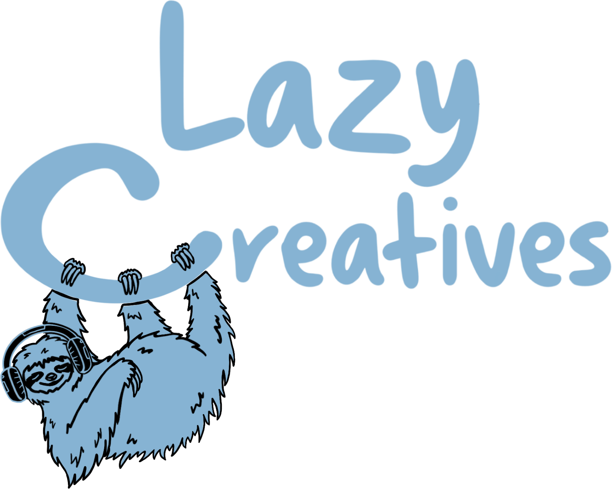

<p align="center">
  
</p>

<h1 align="center">Lazy Creatives — Backups</h1>

<p align="center"><b>Every music project you've made, in one place to browse — plus verified backups that you own.</b></p>

<p align="center">
  <a href="https://lazycreatives.github.io/#download"><b>Download</b></a> ·
  <a href="https://github.com/LazyCreatives/lazycreatives-backups/releases">What's new</a> ·
  <a href="https://github.com/LazyCreatives/lazycreatives-uploader">Sibling tool: Uploader</a>
</p>

Point it at your project folders and it finds every session (Ableton, FL Studio,
Logic Pro, Studio One, Reaper, Audacity, plus Bitwig through its DAWproject export),
follows each one's samples, copies complete de-duplicated snapshots to your own
NAS/drive, then **re-reads and re-hashes every file to prove the backup actually
opens**. No account, and no cloud unless you choose one — you own the storage.

Not ready to back up? Skip that step and just **browse**: every project in one
list whatever app made it, searchable by name, tempo or genre, with the songs you
exported ready to play. Turn backups on later, to a drive, NAS, Dropbox or Google Drive.

> Cloud DAW-sync tools can't make these claims structurally. This can.

Part of [**Lazy Creatives**](https://lazycreatives.github.io) — tools that take the boring,
behind-the-scenes work of making music off your plate. *Looks lazy. Works obsessively.*

---

## Why

- **See everything you've made.** One library of every project on your computer, from every music app, with covers, tempo, genre and the songs you exported. Backing up is optional.
- **Your samples never go missing.** It resolves every referenced sample, and if
  one isn't where the project points, it relinks the *right* file from your
  library (verified by recorded size, not just filename — so it never silently
  backs up a different same-named sample).
- **Backups are verified, not just copied.** Each snapshot ships a manifest of
  every file + content hash; after writing, it re-reads the snapshot to confirm
  nothing was truncated, and you can deep-**Verify** any snapshot on demand
  (re-hashes every byte, and checks the project would open standalone).
- **Space-efficient.** A content-addressed pool + hardlinks mean each dated
  snapshot is a full, openable project but only costs the bytes that changed.
- **Only snapshots when something changed** — no redundant history.
- **Multi-DAW.** Ableton, FL Studio, Logic Pro, Studio One, Reaper, Audacity and DAWproject today; more by adding one adapter.
- **Offsite copies, optional.** Mirror every backup to a second drive, a synced
  folder, or Google Drive / Dropbox / OneDrive with a one-click sign-in (rclone
  ships inside the installers, nothing extra to install).
- **Knows your exports.** Each project lists the songs exported from it, with a
  play button and a SoundCloud link once the sibling Uploader has posted it.

## Download

Free beta, with every feature unlocked. Installers for **Windows**, **Mac (Apple
Silicon)** and **Linux** are on the [Releases page](https://github.com/LazyCreatives/lazycreatives-backups/releases/latest)
and at [lazycreatives.github.io](https://lazycreatives.github.io/#download). They aren't
signed yet, so the first launch shows an "unknown developer" warning; see
[docs/PACKAGING.md](docs/PACKAGING.md) or the website for how to open it on each system.

## Supported DAWs

| DAW | Format | Status |
|---|---|---|
| Ableton Live | `.als` (gzip + XML) | ✅ full — records sample size for high-confidence relink |
| FL Studio | `.flp` (binary) | ✅ via a dependency-free clean-room reader (works across FL versions) |
| Reaper | `.rpp` (text) | ✅ full — also reads tempo, tracks and effects |
| Audacity | `.aup3` (SQLite), `.aup` (XML) | ✅ — old `.aup` backups can't be made portable, and the app says so |
| Studio One / Fender Studio Pro | `.song` (zip of XML) | ✅ full — Windows and Mac; follows the song's Media folder even after a move, reads tempo, key, tracks and plug-ins; skips History autosaves |
| Bitwig (and Studio One exports) | `.dawproject` (export file) | ✅ via the shared DAWproject export |
| Logic Pro | `.logicx` / `.logic` project (Mac package) | ✅ — the whole package plus audio it uses from elsewhere; reads tempo and tracks, not plugin names |

## How it works

```
Setup (once)  →  Scan  →  Review  →  Back up  →  Verify
 folders+NAS      find     pick &     dedup +     re-read &
                  all      relink     snapshot    re-hash
```

Backups land per-DAW on your destination:

```
<NAS>/AbletonBackups/   projects/<name>/<YYYY-MM-DD_HHMM>/   + _pool/  + manifest.json
<NAS>/FLStudioBackups/  projects/<name>/<YYYY-MM-DD_HHMM>/   + _pool/  + manifest.json
…one folder per DAW in the same layout
```

---

## For developers

### How it's built

An **Electron** shell + React/TypeScript renderer over a **Python/FastAPI**
sidecar that does all the file/parse/backup/verify work.

```
electron/   desktop shell + UI (Setup → Home → Library → Dig → Settings)
backend/    ablebackup/ — the engine
  daws/         per-DAW adapters (Ableton, FL Studio, Logic Pro, Studio One, Reaper, Audacity, DAWproject) behind one registry
  scanner       discover + resolve projects (dispatches by file type)
  resolver      resolve sample refs to disk; relink missing from libraries
  backup_engine dedup pool, hardlinks, atomic snapshots, manifest
  verifier      re-read + re-hash a snapshot; portability check
  catalog       SQLite history
```

Adding a DAW = one adapter (discover + parse-to-FileRefs) + one registry line; the
engine, dedup, verify, catalog and relink are reused unchanged.

### Run it from source

Prereqs: Node 20.19+ (or 22.12+), Python 3.11+.

```bash
# backend
cd backend && python -m venv .venv && .venv/bin/pip install -e ".[dev]"

# app (spawns the sidecar automatically)
cd ../electron && npm install && npm start
```

### Tests

```bash
cd backend  && .venv/bin/python -m pytest        # backend tests
cd electron && npm test                          # renderer tests
```
